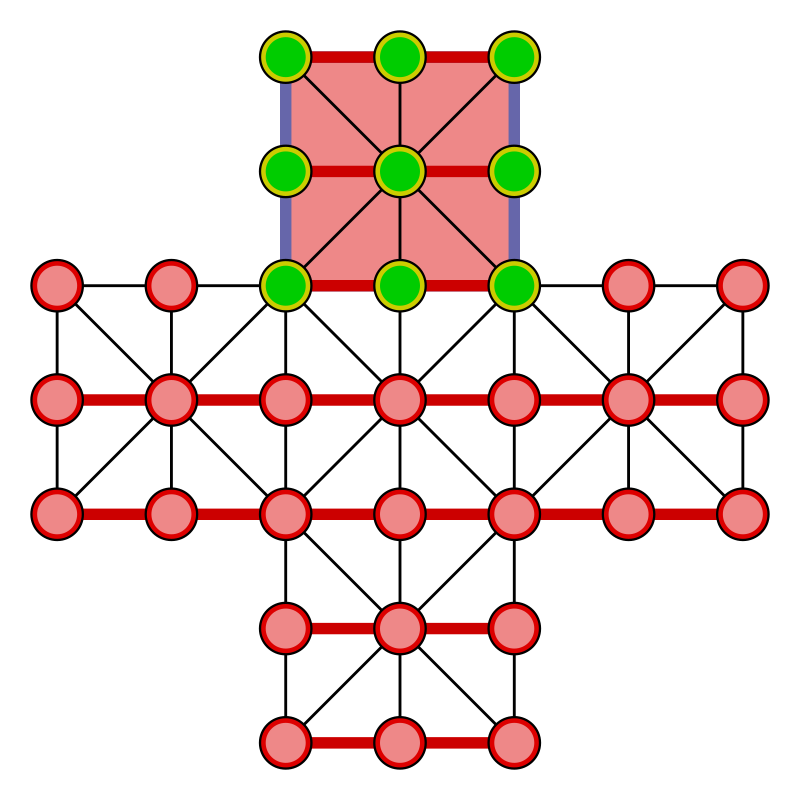
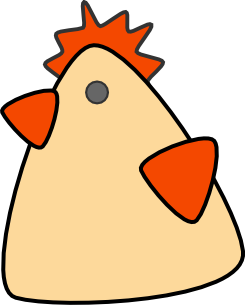
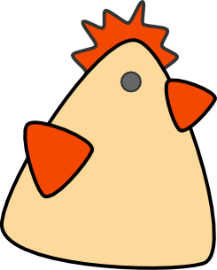
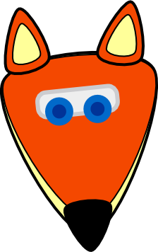
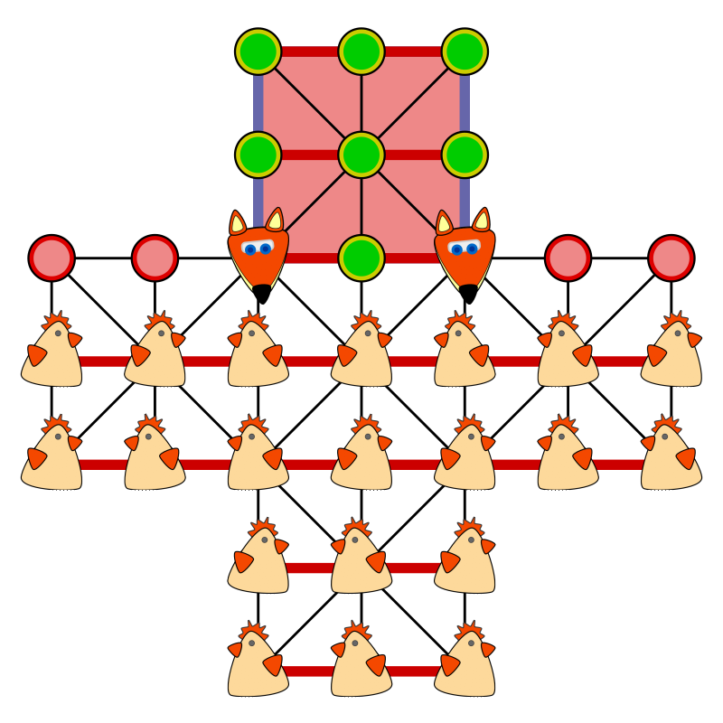

Spielregeln zu Fuchs und Hennen
===============================

Bei "Fuchs und Hennen" handelt es sich um ein traditionelles strategisches Brettspiel für zwei Spieler. Die zugrunde liegende Spielidee ist unbekannten Ursprungs und gemeinfrei. Die Variante mit zwei Füchsen und 20 Hennen ist besonders in deutschsprachigen Ländern wie Deutschland, Österreich oder auch Schweiz populär.

Spielbrett
----------

Neun Felder des Spielbretts sind besonders gekennzeichnet und bilden den Hennenstall, den die Hennen erreichen wollen.

Das Linienmuster oder die Linienfarben zwischen den Spielfeldpositionen kann sich bei anderen "Fuchs und Henne"-Spielen etwas unterscheiden. Farben und Linienverlauf deuten dabei im Regelfall erlaubte Zugrichtungen für die Spielfiguren an. Mehr dazu später …

Spielfiguren
------------
 

&nbsp;&nbsp;&nbsp;&nbsp;&nbsp;
&nbsp;&nbsp;&nbsp;&nbsp;&nbsp;
&nbsp;&nbsp;&nbsp;&nbsp;&nbsp;
&nbsp;&nbsp;&nbsp;&nbsp;&nbsp;
&nbsp;&nbsp;&nbsp;&nbsp;&nbsp;

&nbsp;&nbsp;&nbsp;&nbsp;&nbsp;
&nbsp;&nbsp;&nbsp;&nbsp;&nbsp;
&nbsp;&nbsp;&nbsp;&nbsp;&nbsp;
&nbsp;&nbsp;&nbsp;&nbsp;&nbsp;
&nbsp;&nbsp;&nbsp;&nbsp;&nbsp;

&nbsp;&nbsp;&nbsp;&nbsp;&nbsp;
&nbsp;&nbsp;&nbsp;&nbsp;&nbsp;
&nbsp;&nbsp;&nbsp;&nbsp;&nbsp;
&nbsp;&nbsp;&nbsp;&nbsp;&nbsp;
&nbsp;&nbsp;&nbsp;&nbsp;&nbsp;

&nbsp;&nbsp;&nbsp;&nbsp;&nbsp;
&nbsp;&nbsp;&nbsp;&nbsp;&nbsp;
&nbsp;&nbsp;&nbsp;&nbsp;&nbsp;
&nbsp;&nbsp;&nbsp;&nbsp;&nbsp;
&nbsp;&nbsp;&nbsp;&nbsp;&nbsp;

Abwechselnd spielt einer der Spieler eine der 20 Hennen und …

&nbsp;&nbsp;&nbsp;&nbsp;&nbsp;
&nbsp;&nbsp;&nbsp;&nbsp;&nbsp;

… der andere Spieler zieht einen der zwei Füchse.

Startaufstellung
----------------

Spielzüge
---------

Sowohl Hennen wie Füchse bewegen sich entlang der Spielfeldlinien in gerader Richtung ohne Richtungswechsel innerhalb ihres Zuges. Sie führen dabei zum Beispiel auch keinen Richtungswechsel im einzelnen Sprung aus, wenn etwa ein Fuchs eine Henne überspringt.

Füchse können entweder zu einer der ihnen benachbarten durch Spielfeldlinie erreichbaren freien Spielfeldpositionen ziehen oder fangen eine Henne, indem sie über diese entlang einer geraden Spielfeldlinie auf ein direkt hinter der einzelnen Henne liegendes freies Feld springen. Dies darf, ohne in einem Spielzug abzuzweigen, in jeder durch Spielfeldlinie angezeigten Richtung geschehen. Eine gefangene, beziehungsweise geschlagene Henne wird direkt vom Spielbrett entfernt.

Hennen können zu einer der ihnen benachbarten durch Spielfeldlinie erreichbaren freien Spielfeldpositionen ziehen, dürfen dabei aber weder nach hinten vom Hennenstall weg gezogen, noch seitlich bewegt werden. Es sind ausschließlich Spielzüge auf den Hennenstall zu erlaubt.

Ausnahme sind die vier Positionen auf Höhe der ersten Eingangsfelder des Hennenstalls. Auf diesen vier Feldern sind seitliche Spielzüge erlaubt, dürfen aber auch nur in Richtung des Hennenstalls geschehen.

Es besteht Schlagzwang für die Füchse. Ein Fuchs muss also die entsprechende Henne durch Überspringen schlagen, sollte dies möglich sein. Bestehen mehrere Möglichkeiten zu schlagen auf einmal, so darf frei entschieden werden, welche dieser Schlagmöglichkeiten wahrgenommen wird. Sollte andernfalls der Schlagzwang komplett übersehen werden und dies fällt direkt nach dem Spielzug der Füchse dem Spieler der Hennen auf, so darf dieser auf den Regelverstoß hinweisen. Dabei wird als Strafe der entsprechende Fuchs zeitweise vom Spielfeld genommen. Zieht der Spieler der Hennen, so verfällt sein Recht auf den zuvor missachteten Schlagzwang hinzuweisen. Sollten gleichzeitig beide Füchse jeweils im Schlagzwang sein, so muss nur einer von ihnen den Schlagzwang bedienen und der andere Fuchs bleibt sicher im Spiel. Wird die gleichzeitige Schlagmöglichkeit beider Füchse in solch einem Fall übersehen und es fällt dem Spieler der Hennen auf, so wird nur einer der Füchse (ausgewählt vom Spieler der Hennen) zeitweise entfernt.

Ein vom Spielbrett zweitweise entfernter Fuchs wird dann wieder ins Spiel gebracht, wenn der auf dem Spielbrett verbliebene Fuchs eine Henne schlägt. Dabei darf der Spieler der Füchse selbst entscheiden, auf welcher freien Spielfeldposition der zuvor entfernte Fuchs wieder ins Spiel gebracht wird. Nach der neuen Positionierung des Fuchses ist direkt der Spieler der Hennen am Zug.

Kettenschlagzüge sind erlaubt und es besteht Zwang, eine Kette vollständig zu springen. Wenn ein Fuchs jeweils eine Henne schlägt und von der neuen Spielfeldposition des Fuchses ein weiterer Schlagzug ausgeführt werden kann, so muss dieser auch im gleichen Spielzug weiter ausgeführt werden. So können mehrere Hennen in einem Spielzug geschlagen werden. Während jeweils in einer geraden Linie übersprungen wird, kann jeder weitere Sprung auch gradlinig in eine andere Richtung ausgeführt werden. Können mehrere alternative Sprünge von einer Spielfeldposition möglich sein, so kann der Spieler der Füchse frei entscheiden, welcher weitere Sprung ausgeführt wird. Der Kettensprung endet erst, wenn kein weiteres Schlagen einer Henne möglich ist.

Spielverlauf
------------

Es wird abwechselnd eine Henne und dann ein Fuchs gezogen. Dabei kann und muss der Spieler der Füchse, so es möglich ist, aufgrund des Schlagzwanges bevorzugt eine Henne durch ein Überspringen schlagen oder Kettenschlagzüge ausführen.

Der Spieler der Hennen beginnt das Spiel.

Spielziel
---------

Die Hennen gewinnen, sobald entweder

1. die Füchse keine regelgerechte Zugmöglichkeit mehr haben, also eingeengt sind, oder…
1. beide Füchse aufgrund übersehener Schlagzwänge zeitgleich vom Spielbrett (also nacheinander) entfernt sind oder…
1. die Hennen alle neun Spielfeldpositionen des Hennenstalls besetzt haben.

Die Füchse gewinnen, sobald nur noch weniger als 9 Hennen auf dem Spielfeld sind.

Alternativ kann ein Spieler bei einer eindeutig aussichtlosen Situation zuvor aufgeben. Oft wird ein Ausspielen der Gewinnsituation aber bevorzugt.

Varianten
---------

Mögliche Ausnahmen und Varianten sollten vor Spielbeginn abgesprochen werden.

Es kann ohne zeitweises Entfernen der Füchse bei Übersehen des Schlagzwangs gespielt werden. Angenommen ein einzelner Fuchs könnte schlagen, es wurde aber ein anderer Zug ausgeführt. In diesem Fall wird auf das Übersehen hingewiesen. Die Spielfeldsituation wird so wieder hergestellt, wie sie vor dem übersehenen Schlagzug war und der Schlagzwang wird regelkonform ausgeführt.

Weitere mögliche Varianten decken die Situation ab, in der beide Füchse gleichzeitig schlagen könnten, aber keiner dies machte:

* Es kann von den Spieler vor Spielbeginn festgelegt werden, ob der Spieler der Hennen oder der Spieler der Füchse entscheidet, welcher Fuchs die Strafe bekommt und entfernt wird. Empfehlung ist, dass der Fuchspieler dabei selbst entscheidet.
* In solch einer Situation wurde bereits einer der Füchse normal bewegt und keine Henne übersprungen, beide Füchse hätten aber schlagen können. Nur der Fuchs, der bewegt wurde, wird zeitweise entfernt.
* In solch einer Situation wurde bereits einer der Füchse normal bewegt und keine Henne übersprungen, beide Füchse hätten aber schlagen können. Die Hennen gewinnen damit das Spiel.
* Angenommen beide Füchse könnten schlagen, es wurde aber ein normaler Zug ausgeführt und keine Henne übersprungen. In diesem Fall wird auf das Übersehen hingewiesen. Die Spielfeldsituation wird so wieder hergestellt, wie sie vor dem übersehenen Schlagzug war und der Schlagzwang wird regelkonform mit einem der Füchse ausgeführt.

Eine empfohlene Spielvariante ist es, bei einem zeitweise entfernten Fuchs (Übersehen des Schlagzwanges), der wieder ins gebracht wird, es dem Spieler der Füchse nur zu erlauben, diesen Fuchs explizit und ausschließlich außerhalb des Hennenstalls auf eine freie Spielfeldposition zu platzieren. Nach der neuen Positionierung des Fuchses ist direkt der Spieler der Hennen am Zug.

Eine andere Variante erlaubt es genau dem Spieler der Hennen, festzulegen, auf welcher freien Spielfeldposition ein zuvor zeitweise entfernter Fuchs wieder ins Spiel gebracht wird. Auch hier ist nach der neuen Positionierung des Fuchses direkt der Spieler der Hennen am Zug.

Allgemeines
-----------

Der Sieger darf sich natürlich über einen Gewinn freuen, aber bitte ohne zu übertreiben oder den Verlierer gar absichtlich zu verärgern. Vielleicht möchte man ja nochmals miteinander spielen und auch das sollte den Spielern Spaß bringen.

Der Verlierer darf sich natürlich auch etwas ärgern, aber bitte ohne zu übertreiben. Vielleicht möchte man ja auch dann nochmals miteinander spielen und auch das sollte den Spielern Spaß bringen.

Dem Gegenspieler kann man auch für das Mitspielen danken, bzw. dem Sieger dadurch beglückwünschen, indem man sich nach dem Spiel üblicherweise die rechte Hand reicht. Absichtliches Ignorieren eines angebotenen Händereichens wäre unhöflich. Es wäre daher schön, auf diese Geste einzugehen.

Es handelt sich bei Fuchs und Henne um ein asymmetrisches Spiel, das heißt, die Zugweisen der Spieler unterscheiden sich voneinander. Oft wird bei solchen Spielen ein zweites Mal mit vertauschten Rollen gespielt. Dies wird als Revanche-Spiel bezeichnet. Eine Spielpartie gilt erst dann als gewonnen, wenn ein Spieler einmal in der Rolle der Füchse und auch einmal in der Rolle der Hennen gewonnen hat, also normales Spiel und auch Revanche-Spiel mit vertauschten Rollen gewonnen hat.
